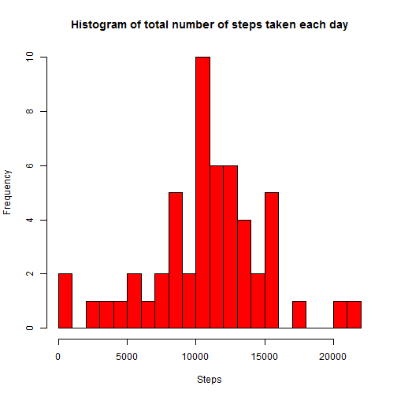
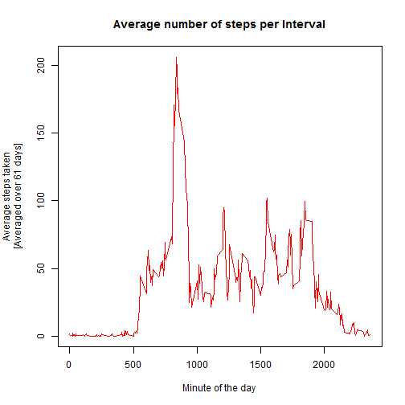
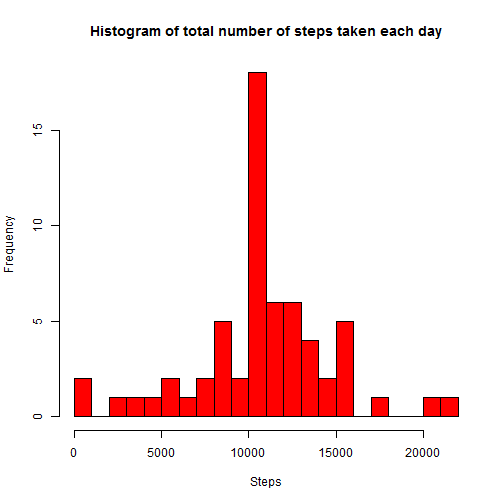
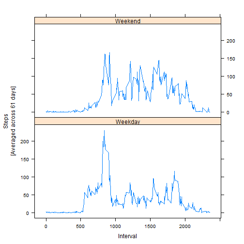

## Loading and preprocessing the data


```r
library(lattice)
#creating temporary file to download data
temp<-tempfile()
fileUrl<-"http://d396qusza40orc.cloudfront.net/repdata%2Fdata%2Factivity.zip"
download.file(fileUrl,temp,mode="wb")

#We unzip the file in current working directory
unzip(temp,exdir=".")
unlink(temp)

#Reading csv file
data<-read.csv("activity.csv",colClasses=c("numeric","Date","numeric"))

#Processing Data
data$date<-as.Date(data$date)
```
  
## What is mean total number of steps taken per day?
  
### 1. Calculate the total number of steps taken per day
  

```r
totalSteps<-aggregate(data$steps,by=list(data$date),sum)
names(totalSteps)<-c("date","total.steps")
```
  
### 2. Make a histogram of the total number of steps taken each day
  

```r
hist(totalSteps$total.steps,col="red",breaks=24,main="Histogram of total number of steps taken each day",xlab="Steps",ylab="Frequency")
```


  
### 3. Calculate and report the mean and median of the total number of steps taken per day
  

```r
mean(totalSteps$total.steps,na.rm=TRUE)
```

```
## [1] 10766.19
```

```r
median(totalSteps$total.steps,na.rm=TRUE)
```

```
## [1] 10765
```

## What is the average daily activity pattern?
### 1. Make a time series plot of the 5-minute interval and the average number of steps taken, averaged across all days

```r
timeSeries<-aggregate(data$steps,by=list(data$interval),mean,na.rm=TRUE)
names(timeSeries)<-c("interval","mean.steps")
par(mar=c(5,5,4,2))
plot(timeSeries$interval,timeSeries$mean.steps,type='l',col="red",main="Average number of steps per Interval",xlab="Minute of the day",ylab="Average steps taken\n[Averaged over 61 days]")
```



### 2. Which 5-minute interval, on average across all the days in the dataset, contains the maximum number of steps?

```r
timeSeries[which.max(timeSeries$mean.steps),]
```

```
##     interval mean.steps
## 104      835   206.1698
```

## Imputing missing values
### 1. Calculate and report the total number of missing values in the dataset

```r
sum(is.na(data))
```

```
## [1] 2304
```

### 2. Devise a strategy for filling in all of the missing values in the dataset.

```r
#we will impute missing values for any interval using average steps for that 5-minute interval [stored in *timeSeries*]
imputeData<-function(data){
  NA_values<-which(is.na(data))
  imputedSteps<-data$steps
  for(i in NA_values){
    imputedSteps[i]<-timeSeries[timeSeries[,1]==data[i,3],2]
  }
  imputedSteps
}
```
### 3. Create a new dataset that is equal to the original dataset but with the missing data filled in.

```r
#replacing *steps* column with imputed column
imputedData<-data
imputedData$steps<-imputeData(data)
summary(imputedData$steps)
```

```
##    Min. 1st Qu.  Median    Mean 3rd Qu.    Max. 
##    0.00    0.00    0.00   37.38   27.00  806.00
```

### 4. Make a histogram of the total number of steps taken each day and Calculate and report the mean and median total number of steps taken per day. Do these values differ from the estimates from the first part of the assignment? What is the impact of imputing missing data on the estimates of the total daily number of steps?

```r
totalSteps2<-aggregate(imputedData$steps,by=list(imputedData$date),sum)
names(totalSteps2)<-c("date","total.steps")

hist(totalSteps2$total.steps,col="red",breaks=24,main="Histogram of total number of steps taken each day",xlab="Steps",ylab="Frequency")
```



```r
mean(totalSteps2$total.steps,na.rm=TRUE)
```

```
## [1] 10766.19
```

```r
median(totalSteps2$total.steps,na.rm=TRUE)
```

```
## [1] 10766.19
```

```r
sum(totalSteps$total.steps,na.rm=TRUE)
```

```
## [1] 570608
```

```r
sum(totalSteps2$total.steps,na.rm=TRUE)
```

```
## [1] 656737.5
```

```r
cat("The mean remains the same while the median has become equal to the mean after imputation.\nThe overall total number of steps increased from 570608 to 6567373.5 i.e. by a factor of ",656737.5/570608,".")
```

```
## The mean remains the same while the median has become equal to the mean after imputation.
## The overall total number of steps increased from 570608 to 6567373.5 i.e. by a factor of  1.150943 .
```

## Are there differences in activity patterns between weekdays and weekends?
### 1. Create a new factor variable in the dataset with two levels - "weekday" and "weekend" indicating whether a given date is a weekday or weekend day.

```r
weekend<-c("Saturday","Sunday")
weekendIndices<-which(weekdays(imputedData$date) %in% weekend)
weekGroup<-rep("Weekday",nrow(imputedData))
weekGroup[weekendIndices]<-"Weekend"
newImputedData<-cbind(imputedData,as.factor(weekGroup))
names(newImputedData)[4]<-"weekgroup"
summary(newImputedData)
```

```
##      steps             date               interval        weekgroup    
##  Min.   :  0.00   Min.   :2012-10-01   Min.   :   0.0   Weekday:12960  
##  1st Qu.:  0.00   1st Qu.:2012-10-16   1st Qu.: 588.8   Weekend: 4608  
##  Median :  0.00   Median :2012-10-31   Median :1177.5                  
##  Mean   : 37.38   Mean   :2012-10-31   Mean   :1177.5                  
##  3rd Qu.: 27.00   3rd Qu.:2012-11-15   3rd Qu.:1766.2                  
##  Max.   :806.00   Max.   :2012-11-30   Max.   :2355.0
```
### 2. Make a panel plot containing a time series plot of the 5-minute interval (x-axis) and the average number of steps taken, averaged across all weekday days or weekend days (y-axis).

```r
weekgroupTimeSeries<-aggregate(newImputedData$steps~newImputedData$interval+newImputedData$weekgroup,newImputedData,mean)
names(weekgroupTimeSeries)<-c("interval","weekgroup","mean.steps")
xyplot(mean.steps~interval|weekgroup,weekgroupTimeSeries,type='l',layout=c(1,2),ylab="Steps\n[Averaged across 61 days]",xlab="Interval")
```


